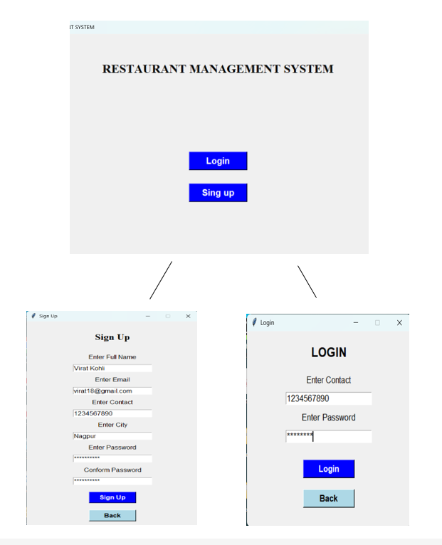
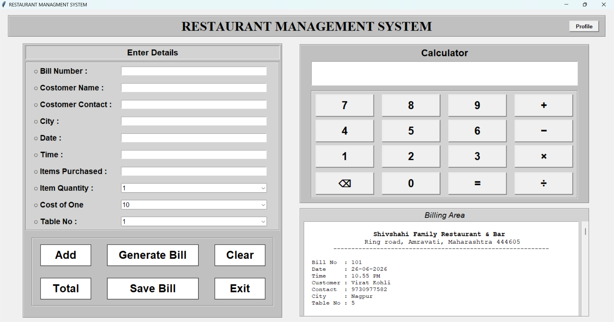
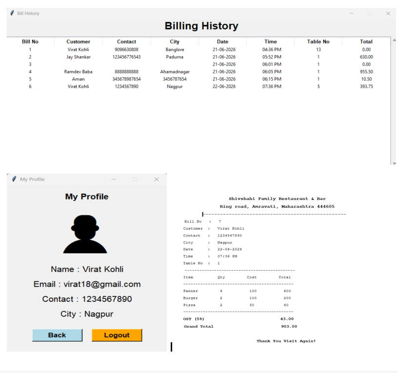

# Restaurant-Management-System
The Restaurant Management System is a desktop-based application developed using Python, Tkinter, MySQL, and PyCharm. The main purpose of this system is to simplify restaurant billing and customer management operations.
The application allows users to register, log in, generate bills, calculate totals automatically, save bills, view billing history, and manage restaurant operations efficiently.

## 📌 Problem Statement
Many small restaurants and hotels still use manual billing systems. These systems create several problems such as Time-consuming bill preparation, Manual calculation errors, Difficulty in maintaining customer records, Difficulty in accessing previous bills 

## Proposed Solution
The proposed solution is a Restaurant Management System that automates restaurant billing and management activities such as User Registration and Login, Customer Information Management, Bill Generation, Bill Storage in MySQL Database, Bill History Management This system reduces manual work, improves accuracy, and stores data permanently in a database.

## 🎯 Key Features
- User Authentication
- Customer Management
- Generate Bill
- Bill History
- Calculate total
- Save bill in Database

## 🛠 Technologies Used
### ⚙ Programming Language:
- Python 3.13
- Tkinter (Python Library for GUI)
### 🗄 Database:
- MySQL
### 🔧 Tools:
- PyCharm

## 📂 Project Structure
```
Restaurant-Management-System
│
├── auth
│   ├── login.py
│   └── signup.py
├── billing
│   ├── bill_generator.py
│   └── bill_history.py
├── dashboard
│   ├── dashboard.py
│   ├── calculator.py
│   └── profile.py
├── database
│   ├── db_connection.py
│   └── queries.py 
├── session.py
└── main.py

```

## ▶ How to Run
- Install Python 3.x
- Install MySQL Server
- Create the required database and tables
- Update database credentials in db_connection.py
- Install required package:
- pip install mysql-connector-python
- Run the project:

## 📥 Download APK

## 📸 Screenshots





